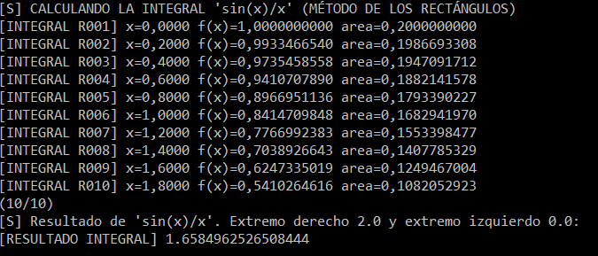
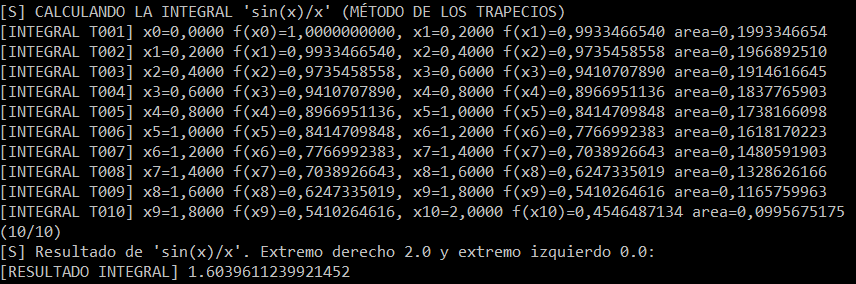

# Calculadora de Integrales en JAVA

- [Calculadora de Integrales en JAVA](#calculadora-de-integrales-en-java)
  - [Introducción](#introducción)
  - [Características](#características)
  - [Ejemplo de uso](#ejemplo-de-uso)
    - [Método de los rectángulos](#método-de-los-rectángulos)
    - [Método de los trapecios](#método-de-los-trapecios)
  - [Ejecución](#ejecución)
  - [Librerías utilizadas](#librerías-utilizadas)


## Introducción

La calculadora es un proyecto grupal propuesto para resolver una serie de integrales, introduciendo la f(x) y los extremos.

El proyecto ha sido realizado por Alejandro García, Ali Hasanzade, Ángel Esquinas, Victor Vega y Jaime García.

Se ha usado Maven para implementar las librerías necesarias.


## Características

La calculadora cuenta con las siguientes opciones:
- Resolución de integrales de forma exacta
- Resolución de integrales por el método de los rectángulos
- Resolución de integrales por el método de los trapecios

## Ejemplo de uso

Sobre la siguiente función introducida, y dividiéndolo en  rectángulos/trapecios (n es un valor especificado por el usuario).

}{x}dx)

### Método de los rectángulos

En este método se coge el punto izquierdo a la hora de encontrar la altura del rectángulo.



### Método de los trapecios

Se evalúa obteniendo el punto izquierdo y derecho,  +f(x_{2})}{2})  



## Ejecución

- Necesario Java JDK o JRE
- Descarga última versión [ejecutable .jar](https://github.com/alxgarci/CalculadoraIntegrales/releases/latest)
- En terminal:
  
  ```
  cd C:\ruta\hacia\CalcIntegrales\
  ```
  
  ```
  java -jar CalcIntegrales_[VERSION].jar
  ```


## Librerías utilizadas

- Se usa la librería mXparser para evaluar las fórmulas con incógnitas y resolver las integrales con un valor exacto.
La licencia se encuentra dentro de la sección DOC de la aplicación. 
Para mas información consultar [su github](https://github.com/mariuszgromada/MathParser.org-mXparser) o [su sitio web](http://mathparser.org/).
- También se usa la herramienta [Maven](https://maven.apache.org/), para gestionar los recursos del proyecto.
